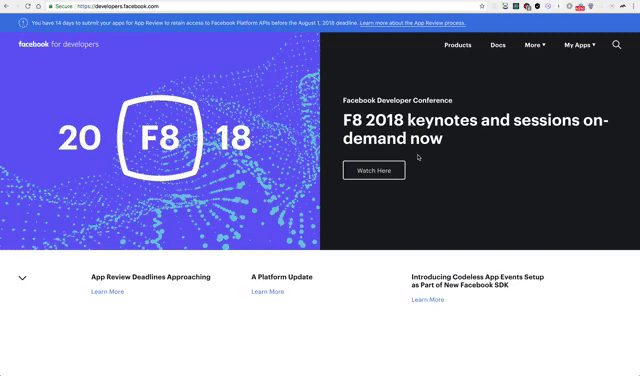

# WEVOTE

# Getting Started

### Technologies Used
- Node
- Express
- Passport
- Graphql
- Apollo Graphql
- React

### Prerequisites
Ensure you have the following installed locally:
- [Node](https://nodejs.org/en/) v9+

### Installing
Clone this git repository:
```sh
$ git clone git@github.com:iykyvic/wevote-api.git
```
Navigate into the root of the cloned directory:
```sh
$ cd wevote-client
```
Install all dependencies:
```sh
$ npm i
```

## Facebook App Configuration
Get started by [creating a Facebook App](https://developers.facebook.com/apps/) if you haven't already.



Select **WWW** and Enable the **Facebook Login**

On the the **Faceook Login** page on the dashboard,
- In the section for **Settings** set your **Valid OAuth Redirect URIs**. The redirect uri would be https://**Your-github-username**.serveo.net/api/v1/auth/facebook/callback in **development** or https://**your-server-url**/api/v1/auth/facebook/callback in **production**
- Click on `Save Changes`


### Run Wevote locally
- Create a **.env** file and configure your environment variables using the **.env.sample** file in the root directory of the repository

- Start the App locally:
  ```sh
  npm run start:dev
  ```
- visit the app at https://**Your-github-username**.serveo.net
- to fix issues with facebook login locally add **NODE_TLS_REJECT_UNAUTHORIZED=0** to your .env file

# Testing New Branches
To test a new branch prior to merging a pull request:
- Run `npm test`
- **_Testing framework setup in progress_**
